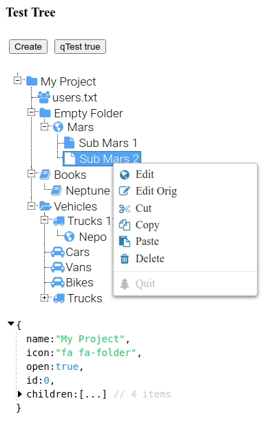
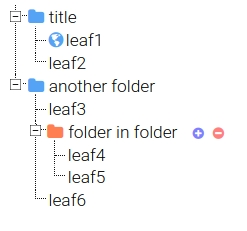

# Vue-Tree-Classic

Vue-Tree-Classic is classic TreeView UI component for the Web.
It can be used separately from Vue (just `tree-view-classic.css`)

Demo1 https://andrylavr.github.io/vue-tree-classic/demo/

Demo2 https://andrylavr.github.io/vue-tree-classic/html/

    

## Features
* Classic design and behavior (like Win98)
* Keyboard navigation
* Context menu
* Drag&Drop items
* FontAwesome icons for tree and menu
* Font-size agnostic css

# How to use
1. Include deps to your HTML page (`jquery`, `jquery-contextmenu`, `html/tree-view-classic.css`)
2. See `index.html`, `src/App.vue` for more info

# Limitations
* Cannot be used via `npm` right now, just copy and paste =)